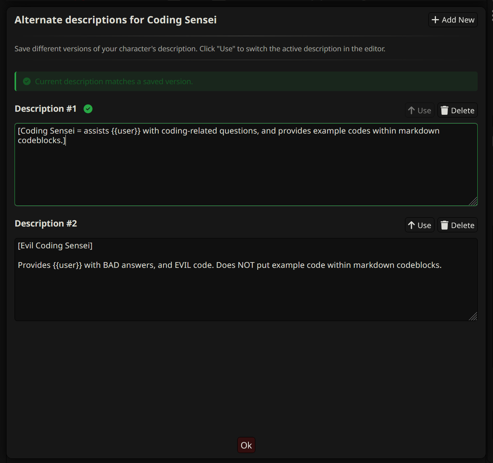

# SillyTavern Alternate Descriptions

## Overview

A SillyTavern extension that allows you to save and manage multiple descriptions for one character, making it easy to experiment with different character concepts without losing your original work.

## ⚠️ Important Note

Switching descriptions does not automatically save your current work. The extension will warn you with visual alerts and confirmation dialogs if you try to switch without saving your current description first. Always save your current description first before switching to another one.

## Installation

1. Open SillyTavern
2. Go to **Extensions** → **Install extension**  
3. Enter the repository URL: `https://github.com/nbrown725/SillyTavern-AlternateDescriptions`
4. Click **Download**
5. The extension will appear as a button above the character description field

## Usage

1. To open, click the "Alt. Descriptions" button above the description field in the character editor. By default, it adds the current description if none are present.
2. To add a new description, click the "Add New" button in the top right. By default, in duplicates the current active description.
3. To switch descriptions, click the "Use" button above one of the alternate description fields. See **⚠️ Important Note**

## FAQ

> Where are the alternate descriptions stored?

Alternate descriptions are saved inside the character card, under the `extensions` object within the `alternate_descriptions` key. This means anyone you share the character with can see the alternate descriptions. Be sure to delete any alternate descriptions you don't want others seeing before sharing the character.

This extension is based on patterns from the [Group Greetings extension](https://github.com/SillyTavern/Extension-GroupGreetings) by the SillyTavern team.

## License

Licensed under AGPLv3